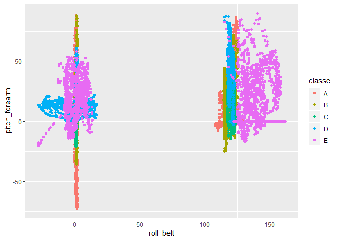
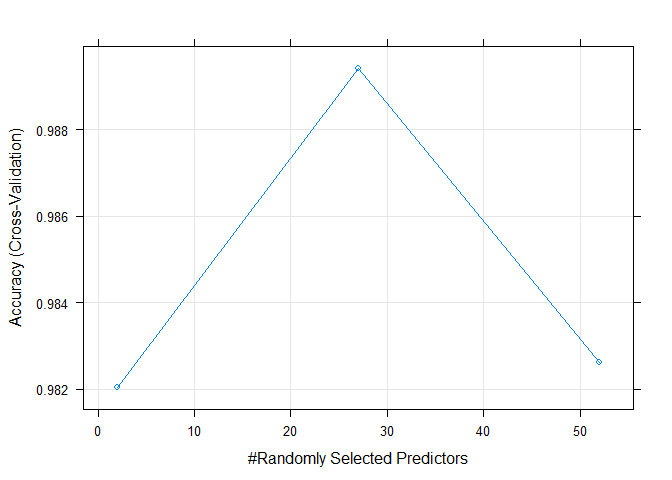

## Introduction
Using devices such as Jawbone Up, Nike FuelBand, and Fitbit it is now possible to collect a large amount of data about personal activity relatively inexpensively. These type of devices are part of the quantified self movement – a group of enthusiasts who take measurements about themselves regularly to improve their health, to find patterns in their behavior, or because they are tech geeks. One thing that people regularly do is quantify how much of a particular activity they do, but they rarely quantify how well they do it.  

#### About project
In this project, my goal will be to use data from sensors to predict activity. This project is part of graduation for [Practical Machine Learning](https://www.coursera.org/learn/practical-machine-learning) course (Peer-graded assignment).

#### About data
Data comes from accelerometers on the belt, forearm, arm, and dumbell of 6 participants. They were asked to perform barbell lifts correctly and incorrectly in 5 different ways. More information is available from the website here: http://groupware.les.inf.puc-rio.br/har (see the section on the Weight Lifting Exercise Dataset).


## Loading data
At first, we need to download and load 2 datasets - one for building model, and other for some kind of validation (to answer quiz as a part of Course grade).

```r
library(caret); library(ggplot2); library(randomForest)
```


```r
# download data
url1 <- "https://d396qusza40orc.cloudfront.net/predmachlearn/pml-training.csv"
url2 <- "https://d396qusza40orc.cloudfront.net/predmachlearn/pml-testing.csv"
download.file(url1, "pml-data.csv")
download.file(url2, "pml-validation.csv")

# load data for building a model and for validation
data       <- read.csv("pml-data.csv", row.names = "X", na.strings = c("",NA))
validating <- read.csv("pml-validation.csv",  row.names = "X", na.strings = c("",NA))
```
There are 19622 rows in the data.


## Split data into training and testing dataset
We will validate data at the end (20-rows dataset, Quiz: Course Project Prediction Quiz - 20 questions). Before that, we want to train prediction algorithm and test it how accurate is on independent dataset -- we split the data into **training** and **testing** dataset.

Reason why training data is a litte bit larger (90%) is that we will use cross-validation on training data (next splitting of training dataset). We will use rest of the data (10%-cut-off) for estimate of out-of-sample accuracy.

```r
# split into training and testing data
inTrain <- createDataPartition(data$classe, p = 0.9, list = FALSE)
training <- data[inTrain,]
testing <- data[-inTrain,]

# dimensions
dim(training)
```

```
## [1] 17662   159
```

```r
dim(testing)
```

```
## [1] 1960  159
```
*Note:* I had long dilema how to split data. I learnt in the course to split big data into training and testing data. In this assignment, it looks like to use whole data as training data, and use cross-validation because we don't have testing data to check confusion matrix and out-of-sample accuracy. I tried to do both and the results are almost the same.

Finaly, I used knowledge from the course. I devided dataset consists of 19622 rows on testing and training data. Second 20-rows dataset, I used it as some kind of validating dataset (validation through quiz in the course).


## Exploration on training subset
We can do some exploration - how can be sensor data related, for example *roll_belt* and *pitch_forearm*.

```r
# plot
qplot(x = roll_belt, y = pitch_forearm, data = training, col=classe)
```

<!-- -->

We can see that there are not strict clusters or something like that. Similar graphs are also for other features.


## Cleaning data
Next step is to exclude features (variables) which is not relevant for the prediction -- data which doesn't become from sensors (some kind of labeling variables). Also, we excluded features which has very low variance (near zero) and would be bad predictors. Moreover, some features included too many NA values (Imputation via K-Nearest Neighbors is not possible to do).

```r
# not relevant features (name, timestamp, window)
noSensorData <- 1:6

# identify near zero variance predictors
nsv <- nearZeroVar(training, saveMetrics = T)
head(nsv, n = 20)
```

```
##                      freqRatio percentUnique zeroVar   nzv
## user_name             1.100534   0.033971238   FALSE FALSE
## raw_timestamp_part_1  1.000000   4.738987657   FALSE FALSE
## raw_timestamp_part_2  1.250000  86.881440380   FALSE FALSE
## cvtd_timestamp        1.005970   0.113237459   FALSE FALSE
## new_window           46.735135   0.011323746   FALSE  TRUE
## num_window            1.000000   4.857886989   FALSE FALSE
## roll_belt             1.119255   7.179254898   FALSE FALSE
## pitch_belt            1.022989  10.191371306   FALSE FALSE
## yaw_belt              1.065502  10.876457932   FALSE FALSE
## total_accel_belt      1.062910   0.164194315   FALSE FALSE
## kurtosis_roll_belt    5.000000   2.038274261   FALSE FALSE
## kurtosis_picth_belt   7.250000   1.698561884   FALSE FALSE
## kurtosis_yaw_belt     0.000000   0.005661873    TRUE  TRUE
## skewness_roll_belt    2.250000   2.026950515   FALSE FALSE
## skewness_roll_belt.1  7.250000   1.766504360   FALSE FALSE
## skewness_yaw_belt     0.000000   0.005661873    TRUE  TRUE
## max_roll_belt         1.000000   1.047446495   FALSE FALSE
## max_picth_belt        1.483333   0.124561205   FALSE FALSE
## max_yaw_belt          1.000000   0.379345487   FALSE FALSE
## min_roll_belt         1.200000   0.979504020   FALSE FALSE
```

```r
lowVariance <- which(nsv$nzv==TRUE)

# almost empty columns
numberNAinCol <- colSums(is.na(training))
table(numberNAinCol)
```

```
## numberNAinCol
##     0 17292 
##    59   100
```

```r
almostEmpty <- which(numberNAinCol != 0)

# exclude columns
exclude <- unique(unname(c(noSensorData, lowVariance, almostEmpty)))
training <- training[, -exclude]
```
*Note*: For near zero variance, Only first 20 variables are printed because I don't want long report.

## Build a model
We want to predict type of activity -- factor variable. This is classification problem and we have several ways how to do that. We use **random forest** (sensor data are characteristic by some random noise) with 10 trees for this purpose. 

We don't use preprocessing of training data, because:

+ classidication - no need to *scale* and *center*,
+ no NA values - no need to *knnImpute*.
+ I tried to use *PCA* because there were some features hightly corelated with other, but I got worse results after *pca* preprocessing.

We use cross-validation on training data because we want to average the estimates (in-sample error and accuracy). While the dataset is quite big, we use 10-fold cross-validation.

```r
# train a model - random forest
modelFit <- train(classe~., data = training, method = "rf", ntree = 10, 
                  trControl = trainControl(method = "cv", number = 10))
```

We can check for in-sample accuracy, parameters of model, and what variables are most important in the model. Graph shows how accuracy of the model depends on randomly selected predictors.

```r
# model
modelFit
```

```
## Random Forest 
## 
## 17662 samples
##    52 predictor
##     5 classes: 'A', 'B', 'C', 'D', 'E' 
## 
## No pre-processing
## Resampling: Cross-Validated (10 fold) 
## Summary of sample sizes: 15895, 15896, 15896, 15896, 15897, 15894, ... 
## Resampling results across tuning parameters:
## 
##   mtry  Accuracy   Kappa    
##    2    0.9820513  0.9772904
##   27    0.9894121  0.9866067
##   52    0.9826185  0.9780092
## 
## Accuracy was used to select the optimal model using the largest value.
## The final value used for the model was mtry = 27.
```

```r
plot(modelFit)
```

<!-- -->

```r
# final model
modelFit$finalModel
```

```
## 
## Call:
##  randomForest(x = x, y = y, ntree = 10, mtry = param$mtry) 
##                Type of random forest: classification
##                      Number of trees: 10
## No. of variables tried at each split: 27
## 
##         OOB estimate of  error rate: 2.64%
## Confusion matrix:
##      A    B    C    D    E class.error
## A 4907   40    7   12    1  0.01207973
## B   60 3253   36   13   16  0.03700414
## C    5   44 2962   30   11  0.02948886
## D   13   21   66 2752   17  0.04078076
## E    6   28   11   25 3139  0.02181365
```

```r
# accuracy for each of 10 folds
modelFit$resample
```

```
##     Accuracy     Kappa Resample
## 1  0.9875425 0.9842473   Fold02
## 2  0.9881154 0.9849671   Fold01
## 3  0.9909400 0.9885378   Fold04
## 4  0.9892412 0.9863881   Fold03
## 5  0.9909502 0.9885511   Fold06
## 6  0.9937677 0.9921165   Fold05
## 7  0.9886686 0.9856642   Fold08
## 8  0.9847112 0.9806595   Fold07
## 9  0.9943407 0.9928418   Fold10
## 10 0.9858437 0.9820934   Fold09
```

```r
# variable importance
varImp(modelFit)
```

```
## rf variable importance
## 
##   only 20 most important variables shown (out of 52)
## 
##                      Overall
## roll_belt            100.000
## yaw_belt              59.054
## pitch_forearm         56.869
## roll_forearm          48.755
## pitch_belt            46.777
## magnet_dumbbell_y     45.332
## magnet_dumbbell_z     40.228
## magnet_dumbbell_x     19.009
## accel_dumbbell_y      17.109
## roll_dumbbell         16.218
## accel_dumbbell_z      15.794
## magnet_forearm_z      14.052
## accel_forearm_x       13.804
## total_accel_dumbbell  13.171
## magnet_belt_z         12.869
## accel_belt_z          12.310
## yaw_arm               10.985
## gyros_belt_z          10.274
## magnet_belt_y         10.166
## yaw_forearm            9.602
```

We can view some tree in the random forest (for exmaple 2nd), but it is too long. Here is at least first 15 rows of that tree.

```r
head(getTree(modelFit$finalModel, k = 2), n = 15)
```

```
##    left daughter right daughter split var split point status prediction
## 1              2              3         1    130.5000      1          0
## 2              4              5        41    -34.1500      1          0
## 3              6              7        16    139.0000      1          0
## 4              8              9        33      0.5150      1          0
## 5             10             11        38    436.5000      1          0
## 6              0              0         0      0.0000     -1          5
## 7             12             13        29    -30.7087      1          0
## 8             14             15        32      1.0350      1          0
## 9              0              0         0      0.0000     -1          2
## 10            16             17        40    122.5000      1          0
## 11            18             19        30      5.5000      1          0
## 12             0              0         0      0.0000     -1          1
## 13             0              0         0      0.0000     -1          5
## 14            20             21        19     -1.5100      1          0
## 15            22             23         7     -0.0400      1          0
```


#### Previous predicting aproaches
We tried to use also other aproaches:

+ **decision tree** (method="rpart"), most simple and easy-to-explain model, but that model had accuracy only about 50%,
+ **boosting on trees** (method="gbm") but results was similar to random forest and learning took longer,
+ **neural networks** (method="nnet") but results was worse and learning took longer too.


## Prediction on testing data
We can expect that out-of-sample accuracy will be lower then in-sample (0.9894) because of overfitting. But while we used cross-validation, it can be similar accuracy.

While we did 10%-cut-off from the data, we can check for out-of-sample accuracy. Also we can visualize confusion matrix in the plot and see what points are missclassified (thanks to geom="jitter", points doesn't overwrite themselves at diagonal, but points outside of diagonal are slightly scattered).

```r
## confusion matrix
confusionMatrix(testing$classe, predict(modelFit, testing))
```

```
## Confusion Matrix and Statistics
## 
##           Reference
## Prediction   A   B   C   D   E
##          A 557   1   0   0   0
##          B   3 376   0   0   0
##          C   0   2 340   0   0
##          D   0   1   2 317   1
##          E   0   0   1   2 357
## 
## Overall Statistics
##                                           
##                Accuracy : 0.9934          
##                  95% CI : (0.9887, 0.9965)
##     No Information Rate : 0.2857          
##     P-Value [Acc > NIR] : < 2.2e-16       
##                                           
##                   Kappa : 0.9916          
##  Mcnemar's Test P-Value : NA              
## 
## Statistics by Class:
## 
##                      Class: A Class: B Class: C Class: D Class: E
## Sensitivity            0.9946   0.9895   0.9913   0.9937   0.9972
## Specificity            0.9993   0.9981   0.9988   0.9976   0.9981
## Pos Pred Value         0.9982   0.9921   0.9942   0.9875   0.9917
## Neg Pred Value         0.9979   0.9975   0.9981   0.9988   0.9994
## Prevalence             0.2857   0.1939   0.1750   0.1628   0.1827
## Detection Rate         0.2842   0.1918   0.1735   0.1617   0.1821
## Detection Prevalence   0.2847   0.1934   0.1745   0.1638   0.1837
## Balanced Accuracy      0.9970   0.9938   0.9950   0.9956   0.9977
```

```r
## plot
qplot(x = testing$classe, y = predict(modelFit, testing), 
      data = testing, col=classe, geom = "jitter", 
      main = "Comparison of predicted and observed classe in testing data", 
      xlab = "observed", ylab = "predicted")
```

<!-- -->


## Validation - prediction for the quiz
At the end, we wanted to predict activity based on the model. Here is prediction for 20 different cases.

```r
predict(modelFit, validating)
```

```
##  [1] B A B A A E D B A A B C B A E E A B B B
## Levels: A B C D E
```

